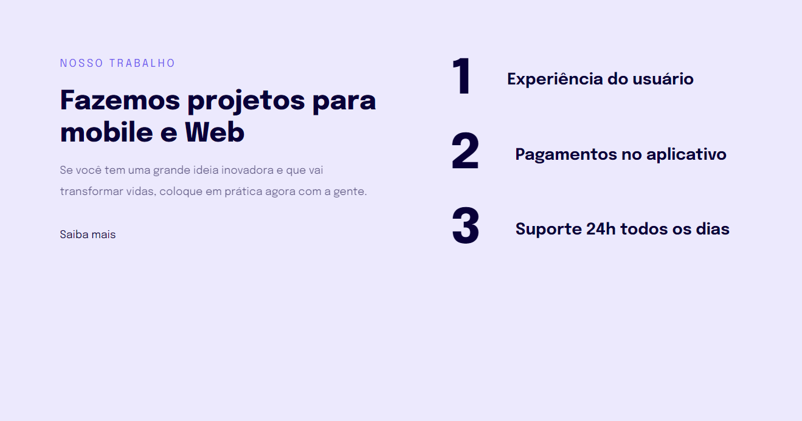
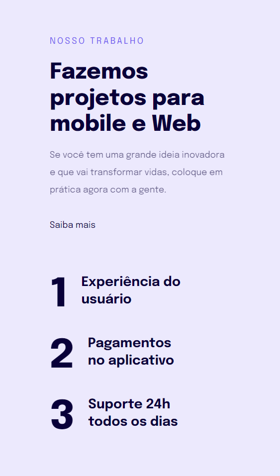

  

	
<h4 align="center"> 
	🚀 Projeto 07 | Stage 03 - Explorer
</h4>

  

  
  
  
  
  <a href="https://laurirodrigues.github.io/Page-Exemplo-de-Responsividade/"> ▶️ Visualizar Deploy </a>

<h2 align=left> 💻 Sobre o projeto </h3>

 Página responsiva simples feita durante o programa <strong>Explorer</strong> da <a href="https://www.rocketseat.com.br/"> <strong>Rocketseat</strong> </a>. É o sétimo projeto do programa, localizado no nível 3, onde construímos uma página simples para conhecimento de conceitos de responsividade, unidade de medidas flexíveis e regra mobile-first. 

  
<h2 align=left> 🛠 Tecnologias utilizadas </h3>

  
  

<h2 align=left> 🎨 Layout </h2>
<a href="https://www.figma.com/file/uC6O8InMRz7n4VMfkjsr1N/Explorer-Stage-03-Projeto-02-(Copy)?node-id=203%3A412"> Visualizar no Figma </a>

<h4>💻 Desktop </h4>

<h4>📱​ Mobile </h4>

